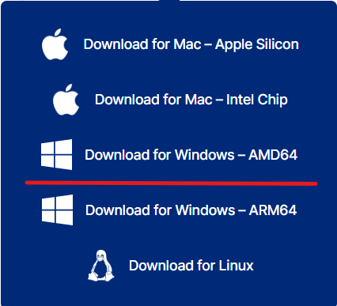
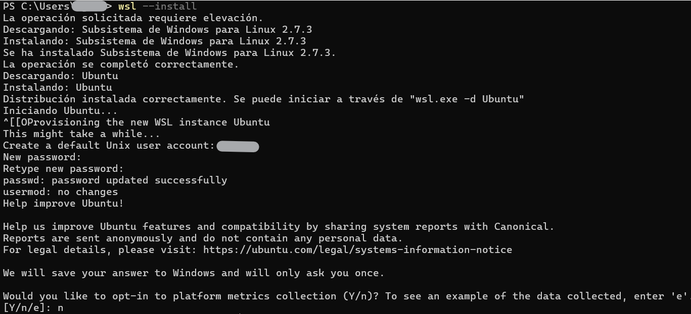
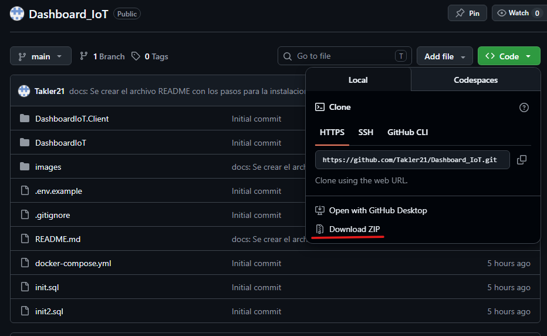
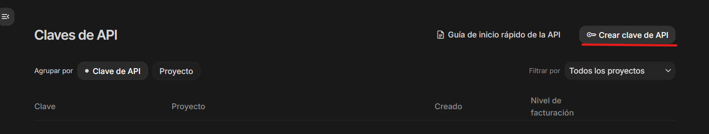
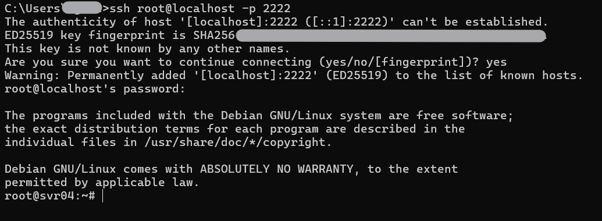
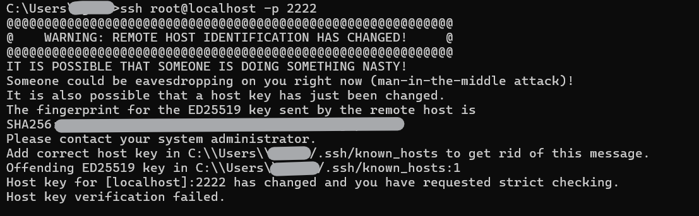

# Dashboard IoT

> Probado y ejecutado en Windows 11.

## Requisitos previos

Instalar [Docker Desktop](https://www.docker.com/products/docker-desktop/).



He descargado la versión correspondiente a Windows AMD64; la versión dependerá del equipo en el que se quiera ejecutar la aplicación.

Dar a _siguiente_ en el instalador hasta finalizar la instalación, y reiniciar el ordenador cuando el instalador lo solicite.

Tras instalar Docker Desktop, abrir PowerShell **como administrador** y ejecutar:

```powershell
wsl --install
```



Durante la instalación de WSL se solicitará crear un usuario y contraseña para Ubuntu (Linux). Estas credenciales son independientes de la cuenta de Windows; cualquier nombre y contraseña son válidos para los propósitos del proyecto.

## Descarga y configuración del proyecto

Descargar el archivo ZIP del repositorio: [https://github.com/Takler21/Dashboard_IoT](https://github.com/Takler21/Dashboard_IoT).



Extraer el contenido de la carpeta y acceder al directorio raíz del proyecto.

Renombrar el archivo `.env.example` como `.env`.

### Variables de entorno

Obtener las claves para `GEMINI_API_KEY` y `JWT_SECRET_KEY`:

**JWT_SECRET_KEY** — ejecutar el siguiente comando en PowerShell y copiar la clave generada:

```powershell
$bytes = New-Object byte[] 48; (New-Object System.Security.Cryptography.RNGCryptoServiceProvider).GetBytes($bytes); [Convert]::ToBase64String($bytes)
```

**GEMINI_API_KEY** — acceder a [Google AI Studio](https://aistudio.google.com/apikey) con una cuenta de Google y seleccionar la opción para crear una clave API.



Copiar la clave y pegarla en el archivo `.env`.

### Datos iniciales (opcional)

Previo a la ejecución de los contenedores, para realizar una carga inicial de la base de datos con registros y clasificaciones de ejemplo, eliminar el archivo `init.sql` y renombrar `init2.sql` como `init.sql`. Este paso es opcional; en caso de no realizarlo, la base de datos se iniciará vacía y los registros se podrán cargar directamente desde la aplicación.

## Ejecución

Con el entorno y las variables configuradas, asegurarse de que Docker Desktop esté en ejecución (aparece en la bandeja de tareas de Windows).

Ejecutar en el directorio del proyecto:

- `Instalar.bat` — construye los contenedores por primera vez, o los borra y reconstruye desde cero.
- `Arrancar.bat` — levanta los contenedores y abre el navegador en la aplicación.

La aplicación queda accesible en:

- Frontend: [http://localhost:8080](http://localhost:8080)
- API: [http://localhost:5000](http://localhost:5000)

## Uso

### Acceso

Credenciales de prueba creadas en `init.sql`:

- **Email:** `administrador@uoc.edu`
- **Contraseña:** `admin`

### Carga de registros desde CSV

Si se ha usado `init.sql` por defecto no habrá registros. Pueden añadirse mediante un archivo CSV con un formato compatible, como los que podéis encontrar en [IoT-23 Full Dataset en Kaggle](https://www.kaggle.com/datasets/surajsooraj26/iot-23/data). La descarga desde Kaggle requiere crear una cuenta gratuita.

### Generación de tráfico con el honeypot Cowrie

Conectarse al sensor de Cowrie desplegado mediante:

```bash
ssh root@localhost -p 2222
```



En la primera conexión preguntará si se quiere continuar: indicar `yes`. A continuación, introducir una contraseña genérica como `admin` para acceder al sensor.

Una vez dentro, se pueden ejecutar diferentes comandos para generar registros que se enviarán a la aplicación, por ejemplo:

```bash
whoami
uname -a
cat /etc/passwd
```

## Notas

Las estadísticas del dashboard (gráfico y contadores) se actualizan al recargar la vista o al navegar entre pantallas. No se refrescan automáticamente en tiempo real.

### Reinicio del contenedor Cowrie

Si tras haber accedido por primera vez al sensor de Cowrie se reconstruye el contenedor (por ejemplo, al volver a ejecutar `Instalar.bat`), al intentar reconectarse aparecerá un error similar al siguiente:



Ejecutar el siguiente comando y volver a conectarse al sensor:

```bash
ssh-keygen -R [localhost]:2222
```
